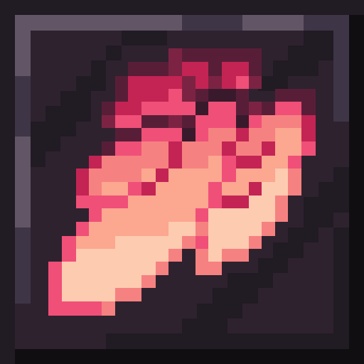

# Eyes of Ender

<!-- todo: replace 494721 with your CurseForge project id -->
[][releases]
[][curseforge]

[][curseforge:files]

It is built on the [Quilt][quilt] mod loader and is available for modern
versions of [Minecraft][minecraft] Java Edition.

## Licence
* Eyes of Ender
  - (c) 2022 Captain ccavet
* Code
  - (c) 2022  [MrSterner]
  - 
* Models and Textures
  - (c) 2022  MrBurrito
  - 

[contributing]: https://discord.gg/XjfPHVJdNn
[curseforge]: https://curseforge.com/minecraft/mc-mods/eyes-of-ender/files
[curseforge:files]: https://curseforge.com/minecraft/mc-mods/eyes-of-ender/files
[quilt]: https://quiltmc.org/
[minecraft]: https://minecraft.net/
[releases]: https://github.com/mrsterner/Eyes-of-Ender/releases
[mrsterner]: https://github.com/mrsterner
